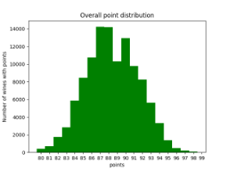
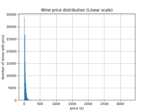
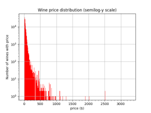

**Wines of the world**

INTRODUCTION TO THE DATA SET

This work is based on the [“Wine Reviews”](<https://www.kaggle.com/datasets/zynicide/wine-reviews>) data set published on Kaggle, where it can be downloaded. The details of the data are discussed there also. Briefly, it contains about information for about 110,000 unique wines (after deduplication). The following is a random sample of the data set, shown in a pandas Dawines_datasamplektaframe format.

Below is a random sample of the data set.

| Column name | Explanation | Examples |
| --- | --- | --- |
| Points | Number of points given by the taster (see Taster-name) | Integer from 80-97. |
| Title | This is the text that appears on the label. It almost always contains the vintage (year of production). | Gloria Ferrer NV Sonoma Brut Sparkling (Sonoma County) |
| Description | The review by the taster. This typically is a text of about a few hundred words. |     |
| Taster-name | Name of the reviewer (if available) |     |
| Taster-twitter-handle | Taster twitter handle. (Redundant for our purpose, not used) |     |
| Price | Price of wine | Range $4 to 3,330.  Mean $35.62  Median $ 25 |
| Designation | Addition description found on the label of the wine, in addition to the title. Not entirely consistent. |     |
| Variety | This typically contains the variety of the grape, or if it is a blend or unknown it is the type of the wine. | Pinot Noir, Gewürztraminer. |
| Region-1 | These four columns tells the location the wine came from. The info is sometimes redundant and the categorization is not always consistent. |     |
| Region-2 |     |
| Province |     |
| Country |     |
| Winery | The name of the winery |     |

POINTS: This is the points given by the reviewer to the wine. The range is 80-100 points, with a mean of 88.4 ± 3.1 1s.

However, each taster has bias and variance (or grades by a different curve, in layman parlance), so the points are normalized by the subtracting it from the mean and dividing it by the standard deviation for the taster. The normalized points (called norm-points) is used instead of points in the model.

| **taster-name** | **count** | **mean points** | **min** | **max** | **std** |
| --- | --- | --- | --- | --- | --- |
| Alexander Peartree | 381 | 85.78 | 80  | 91  | 1.9 |
| Anna Lee C. Iijima | 3974 | 88.41 | 80  | 98  | 2.6 |
| Anne Krebiehl MW | 3036 | 90.68 | 80  | 97  | 2.4 |
| Carrie Dykes | 128 | 86.34 | 81  | 92  | 2.0 |
| Christina Pickard | 6   | 87.83 | 82  | 93  | 3.6 |
| Fiona Adams | 24  | 86.75 | 82  | 91  | 1.8 |
| Jeff Jenssen | 436 | 88.33 | 82  | 97  | 2.1 |
| Jim Gordon | 3761 | 88.60 | 80  | 97  | 2.7 |
| Joe Czerwinski | 4644 | 88.52 | 80  | 100 | 2.9 |
| Kerin O’Keefe | 8885 | 88.94 | 80  | 100 | 2.5 |
| Lauren Buzzeo | 1582 | 87.50 | 81  | 95  | 2.5 |
| Matt Kettmann | 5643 | 90.09 | 81  | 97  | 2.6 |
| Michael Schachner | 13871 | 86.86 | 80  | 98  | 3.1 |
| Mike DeSimone | 452 | 89.12 | 82  | 94  | 2.0 |
| Paul Gregutt | 8838 | 89.10 | 80  | 100 | 2.9 |
| Roger Voss | 18543 | 88.62 | 80  | 100 | 3.1 |
| Sean P. Sullivan | 4423 | 88.76 | 80  | 97  | 2.5 |
| Susan Kostrzewa | 1011 | 86.59 | 80  | 94  | 2.4 |
| Unknown | 23273 | 87.78 | 80  | 100 | 3.3 |
| Virginie Boone | 8682 | 89.22 | 80  | 99  | 3.1 |

PRICE

Most of the wines are priced below $36. However, the highest priced wines are $3,300. Because of the sparsity of data at higher prices, the error of the ML model’s predictions increase as the price increases.

| &nbsp; | Minimum | Maximum | Mean | Median |
| --- | --- | --- | --- | --- |
| Price | $4  | $3,300 | $35.62 | $25 |

_price distribution_

DESIGNATION: This field typically contains extra information probably found on the label of the wine, in addition to that already covered in the _title_. It is not entirely consistent. Below are the top 40 Designations.

VARIETY: This is the variety of wine which often is the name of the grape. The categories are usually very well recognized by the wine consumer, so it is a very important category.

LOCATION: Below are the 40 most popular locations for where a wine comes from. Notice most are from the US. This is not surprising, as the reviewers are all Americans.

