<h1>Wines of the world<h4>

**INTRODUCTION TO THE DATA SET**

This work is based on the [“Wine Reviews”](<https://www.kaggle.com/datasets/zynicide/wine-reviews>) data set published on Kaggle, where it can be downloaded. The details of the data are discussed there also. Briefly, it contains about information for about 110,000 unique wines (after deduplication). The following is a random sample of the data set, shown in a pandas dataframe format.

Below are 5 randomly sampled wines of the data set.

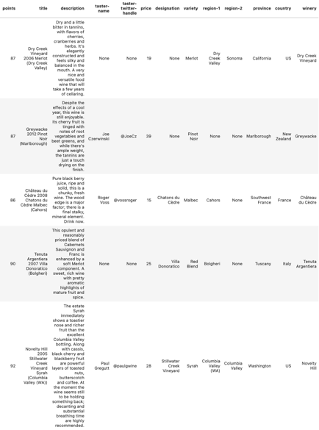

| Column name | Explanation | Notes/Examples |
| --- | --- | --- |
| Points | Number of points given by the taster (see Taster-name) | Integer from 80 to 97. |
| Title | This is the text that appears on the label. It almost always contains the vintage (year of production). | Gloria Ferrer NV Sonoma Brut Sparkling (Sonoma County) |
| Description | The review by the taster. This typically is a text of about a few hundred words. |_"This dry Vinho Verde shows great crisp, green apple and grapefruit flavors, a deliciously fresh wine, with green edges and lively flavors. Great summer drink."_ |
| Taster-name | Name of the reviewer (if available) | Virginie Boone |
| Taster-twitter-handle | Taster twitter handle. |  (Redundant for our purpose, not used) |
| Price | Price of wine | _Range_: $4 to 3,330,  _Mean_: $35.62,   _Median_: $25 |
| Designation | Addition description found on the label of the wine, in addition to the title. Not entirely consistent. |Top 5: _1.'Grande Reserva', 2.'Klipsun Vineyard', 3.'Montée de Tonnerre Premier Cru', 4.'San Lorenzo', 5.'Lawrence Vineyard'_|
| Variety | This typically contains the variety of the grape, or if it is a blend or unknown it is the type of the wine. | Pinot Noir, Gewürztraminer. |
| Region-1,  Region-2, Province, Country| These four columns tell the location the wine came from. The info is sometimes redundant and the categorization is not always consistent. |'Napa Valley', 'Napa', 'California', 'US'|
| Winery | The name of the winery |'Kendall-Jackson'|

POINTS: This is the points given by the reviewer to the wine. The range is 80-100 points, with a mean of 88.4 ± 3.1 1s.

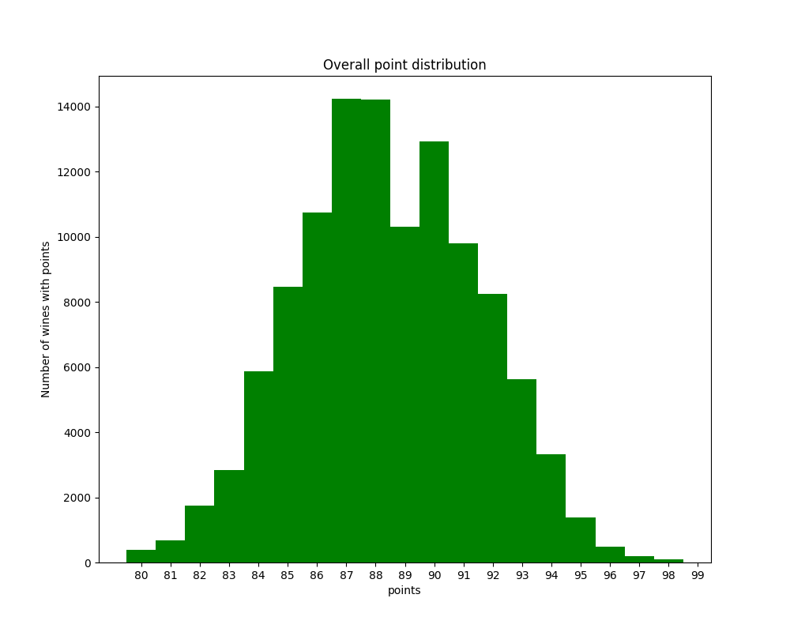

However, each taster has bias and variance (or grades by a different curve, in layman parlance), so the points are normalized by the subtracting it from the mean and dividing it by the standard deviation for the taster. The normalized points (called norm-points) is used instead of points in the model.

| **taster-name** | **count** | **mean points** | **min** | **max** | **std** |
| --- | --- | --- | --- | --- | --- |
| Alexander Peartree | 381 | 85.78 | 80  | 91  | 1.9 |
| Anna Lee C. Iijima | 3974 | 88.41 | 80  | 98  | 2.6 |
| Anne Krebiehl MW | 3036 | 90.68 | 80  | 97  | 2.4 |
| Carrie Dykes | 128 | 86.34 | 81  | 92  | 2.0 |
| Christina Pickard | 6   | 87.83 | 82  | 93  | 3.6 |
| Fiona Adams | 24  | 86.75 | 82  | 91  | 1.8 |
| Jeff Jenssen | 436 | 88.33 | 82  | 97  | 2.1 |
| Jim Gordon | 3761 | 88.60 | 80  | 97  | 2.7 |
| Joe Czerwinski | 4644 | 88.52 | 80  | 100 | 2.9 |
| Kerin O'Keefe | 8885 | 88.94 | 80  | 100 | 2.5 |
| Lauren Buzzeo | 1582 | 87.50 | 81  | 95  | 2.5 |
| Matt Kettmann | 5643 | 90.09 | 81  | 97  | 2.6 |
| Michael Schachner | 13871 | 86.86 | 80  | 98  | 3.1 |
| Mike DeSimone | 452 | 89.12 | 82  | 94  | 2.0 |
| Paul Gregutt | 8838 | 89.10 | 80  | 100 | 2.9 |
| Roger Voss | 18543 | 88.62 | 80  | 100 | 3.1 |
| Sean P. Sullivan | 4423 | 88.76 | 80  | 97  | 2.5 |
| Susan Kostrzewa | 1011 | 86.59 | 80  | 94  | 2.4 |
| Unknown | 23273 | 87.78 | 80  | 100 | 3.3 |
| Virginie Boone | 8682 | 89.22 | 80  | 99  | 3.1 |

PRICE

Most of the wines are priced below $36. However, the highest priced wines are $3,300. Because of the sparsity of data at higher prices, the error of the ML model’s predictions increase as the price increases.

| &nbsp; | Minimum | Maximum | Mean | Median |
| --- | --- | --- | --- | --- |
| Price | $4  | $3,300 | $35.62 | $25 |

_price distribution_

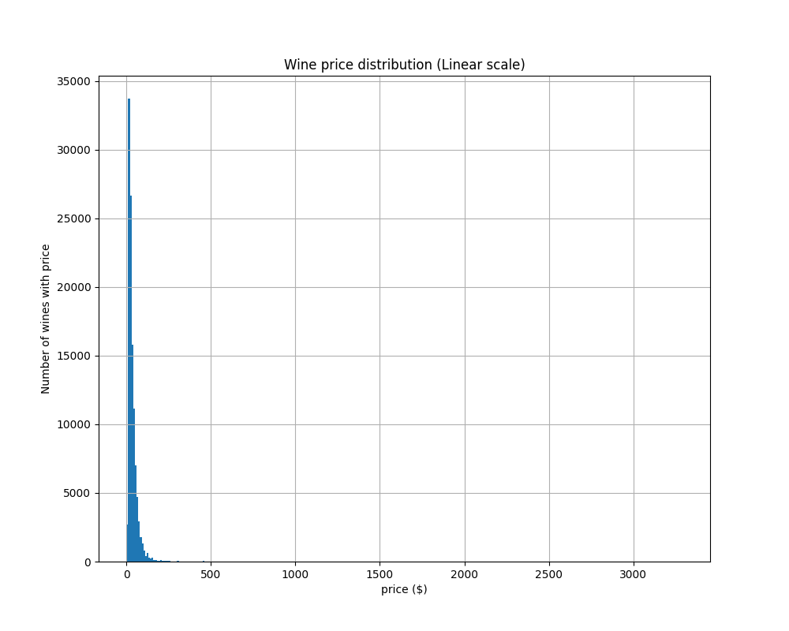

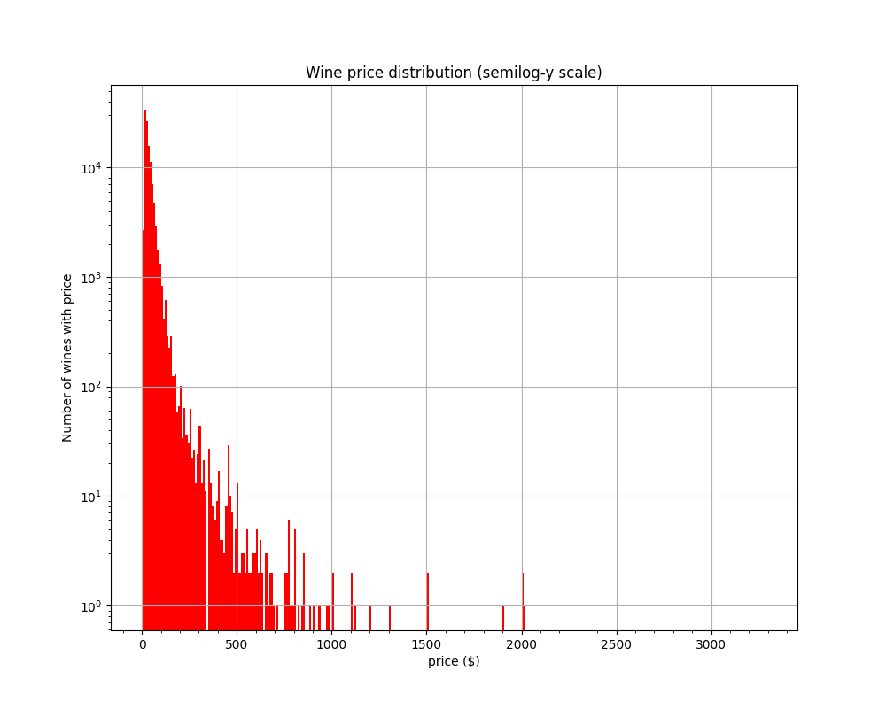

DESIGNATION: This field typically contains extra information probably found on the label of the wine, in addition to that already covered in the _title_. It is not entirely consistent. Below are the top 40 Designations.

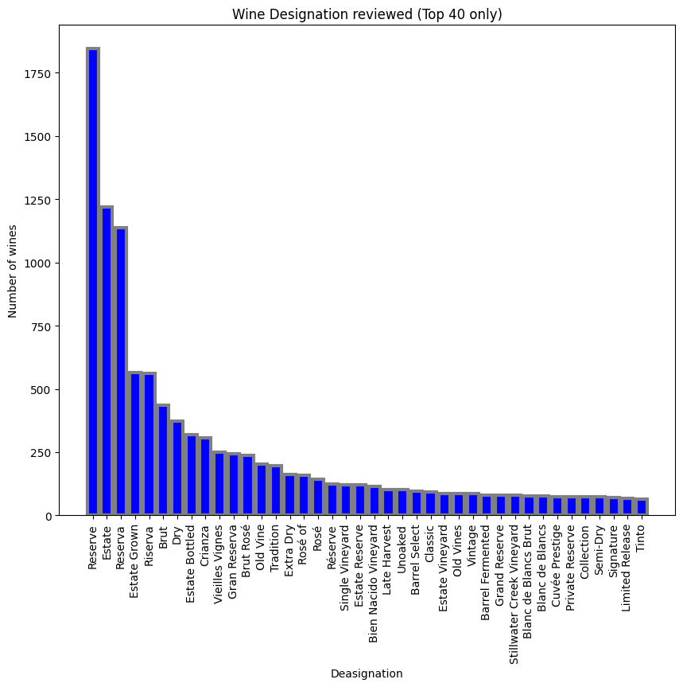

VARIETY: This is the variety of wine which often is the name of the grape. The categories are usually very well recognized by the wine consumer, so it is a very important category.

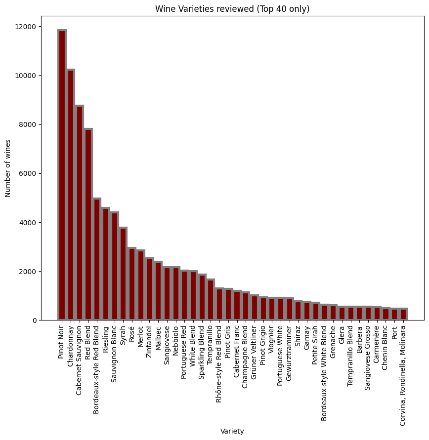

LOCATION: Below are the 40 most popular locations for where a wine comes from. Notice most are from the US. This is not surprising, as the reviewers are all Americans.

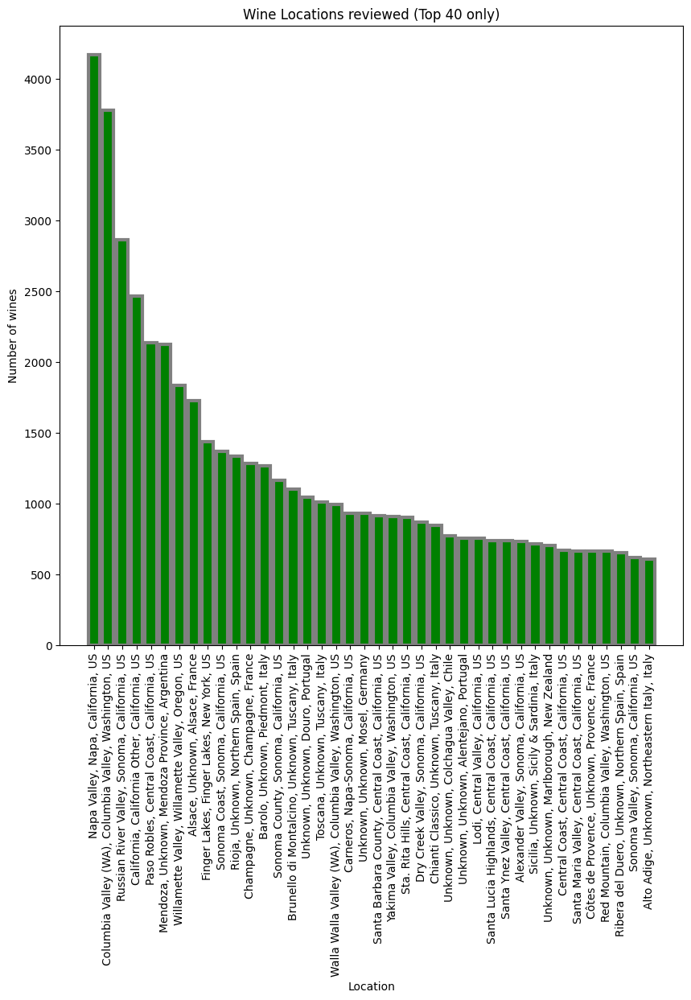

**Price model**

Business use case:

1. Price determination: How much should a vendor price a wine?
2. Marketing:
    a. What are the terms to put on or leave off a label?
    b. What are the desirable intrinsic aspects of a wine (variety, location, etc.)?

FEATURIZATION

- The main data were divided into three sets (train, val, holdout) in the proportions of 8: 1: 1.
- Pipeline (sklearn) was used to featurized to avoid data leak. As a consequence, all the substeps were enclosed in a python wrapper object with _.fit_ and _.transform_ methods.

1. Points:

See section on points above.

1. Text (title)
    1. The general scheme is to tokenize the title and variety into words and convert them into one-hot columns of monograms and bigrams. Bigrams are important in general. In the present use case, many of the grapes which were derivatives of the same variety but have very different flavor profiles. For example, _Pinot+Noir_ and _Pinot+Gris,_ and _Cabernet+Sauvignon_ and _Sauvignon+Blanc_. It is better to link them beforehand rather than relying on the model to discover them.
    2. Stop words. Custom stop words. Remove foreign articles. No need for entire stop words our corpus is proper nouns, and not made of complete sentences.
    3. “_Saint words_”: The proper names of many labels and locations are meaningless on their own. They are linked up to the words ahead of them. Example: _St. Emilion_ becomes _StEmilion_.
    4. **Winery**_**name**, **designation**, and location (**region, province, country, and taster-name**) were _not_ one-hotted as the complete expression represents unique information. For example, “_New York”_ means one thing, but _New_ and _York_ separately can mean two separate things.

MODELS

GBM, RFM, Deep Neural Network.

GBM: 
1. Employs weak learners (short trees) in series to fit the residues.  
2. Typically the highest performing decision tree based model. 
3. Regularization: Number of features per tree.
4. The drawback is its speed, since it builds decision trees in series so it is difficult to parallelize.
    

RFM: 
1. Uses strong learners (deep trees). 
2. Avoids overfitting by fitting multiple trees in parallel.  
3. Trees are _decorrelated_ by changing the features each has access to (max_features parameter)
4. Usually performs slightly less well the GBM.  Good for Proof of Concept experiments.

Neural Network: 
1. State of the art.
2. However, requires a lot of data takes a long time to train.
3. Often does not performs as well as _decision tree_ models on tabulated data.

RESULTS:

|     | Holdout | Holdout |     |     |     |
| --- | --- | --- | --- | --- | --- |
| Model | **MdAPE (%)** | **R^2** | **model library** | **Parameters** | **Notes** |
| GBM | 21.9 | 0.445 | xgboost.XGBRegressor | lr = 1e-4, autostop = 20, num trees = 91596, max tree depth = 6 | It takes about six hours to run this, which is longer than the Random Forset model, because the trees have to built in series. Typically, this model performs better than random forest, but not in this case. |
| RFM | 20.7 | 0.437 | scikit learn RandomForestRegressor | max_depth= 250,  num of trees = 2000,  max number of features per tree = "sqrt" or sqrt(3000) = 55. | The is surprisingly fast, taking slightly less than one hour on my Mac M2 laptop (10 GPU), because the trees can be trained in parallel. However, what is even more surprising is it achieved a slightly lower error than GBM. |
| Neural Network | 26.6 | 0.466 | Keras | Layers = (128, 64, 32, 16, 8, 4, 2), dropouts = 0.2 | I rejected this model early because it took too long to train neural network for this task. To speed things up, I selected the top 128 most popular features among the 3000 to put in the model. I have the tried using PCA to select the best results, but that would lose the useful information on feature importance. It is well known that _decision tree_ models tend to perform better the neural network models.  It is especially not worthwhile unless you have a very large data set.  (110k data points is small)

Both the _decision tree_ model perform well with MdAPE ~ 21-22%.  For pure price prediction purpose, we should employ the RFM model because it yielded marginaly better results.  However, for the next section involving Shapley value analysis, we shall employ the GBM model because it takes much longer to calculate the Shapley values of an RFM than for a GBM model.  

**Important factors that affect prices**

Often it is useful to find which features have the biggest impact on the results of the model. The simplest is to use the “feature_importance” output of the decision tree model. There are many ways to calculate it, but mostly often, it is the sum of the losses caused by the feature. Below is the top 40 features for the Random Forest Model. One can see that the importance is dominated by the norm-point (normalized points given by the taster), then followed by the vintage (i.e. year) of the wine. This is likely to be too simplistic.

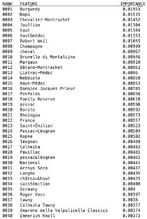 

SHAPLEY VALUES

A better approach is find the [_Shapley Values_ ](<https://www.investopedia.com/terms/s/shapley-value.asp#:~:text=Essentially%2C%20the%20Shapley%20value%20is,or%20less%20than%20the%20others.>)for the features. It derives from the _marginal contribution_ of each feature to a prediction, after applying all other features. In game theory, Shapley values help determine how much each player in a collaborative game has contributed to the total payout. For a machine learning model, each feature is considered a "player". The Shapley value for a feature represents the average magnitude of that feature's contribution across all possible combinations of features. Specifically, Shapley values are calculated by comparing a model's predictions with and without a particular feature present. This is done iteratively for each feature and each sample in the dataset. By assigning each feature an importance value for every prediction, SHAP values provide a local, consistent explanation of how the model behaves. They reveal which features have the most impact on a specific prediction, whether positively or negatively. This is valuable for understanding the reasoning behind complex machine learning models such as [_deep neural networks_](<https://www.kdnuggets.com/2023/08/shap-values-model-interpretability-machine-learning.html>)

We employ the SHAP library to carry out the calculations and the plotting. Another important advantage of shap values it allows us to see not just the degree, but also sign of a feature’s impact (positive or negative) on the prediction \[\]. It takes much longer to run shap on the RFM model (more than 2 weeks so I had to stop) than on the GBM (2 days) because the large number and large sizes of the decision trees in the former, whereas in the latter model, even though the trees are more numerous, they are much smaller.

1. It is unclear why _norm-points_ is ranked very low by the GBM model’s native _Feature_importances_. In fact, at rank 44 it is outside of the table. However, _norm-points_ is ranked first by shap. _Feature_importances_ is determined by the loss during modeling, whereas the shap values are determined by the incremental change in prediction when the feature value is changed. It is possible that at a fundamental level, there is a difference between the two.
2. Some wines or regions drive the prices up, such as as _Napa, Burgundy, Champagne._
3. _Champagne_ was the most expensive grape type. Surprising, _merlot_ was having a resurgent. _Sauvignon Blanc_ was the lowest cost wine type.

    

1. The best wines are French.

    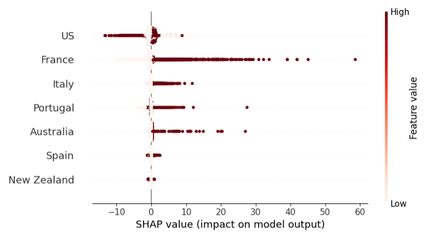

1. Shapley values can also shed light on the impact of vintage on the price of the wine. Below we can see Year 2009 is the best year, whereas 2014 is probably the worst.

    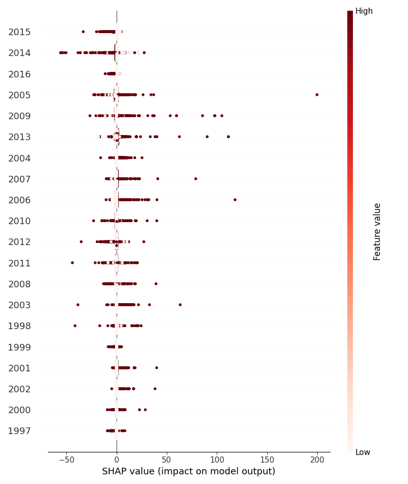

1. For the US, Napa Valley on average drives the price highest, although there are more good wines from Sonoma which as a group has the most positive impact.

    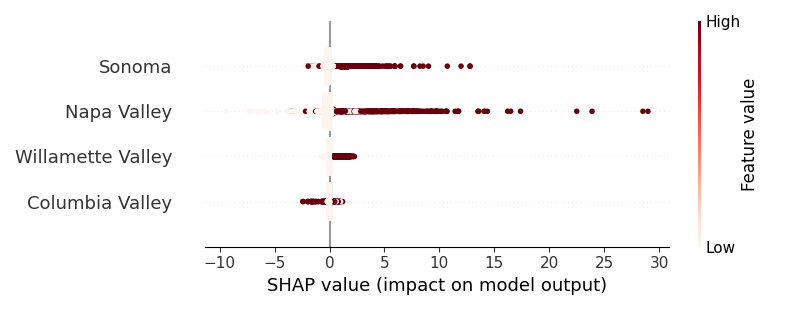
1. Most tasters choose expensive wines to taste, or their ratings would drive the prices up, such as _Virginia Boone_ and _Joe Czerwinski_. However, some of the tasters, such as _Susan Kostrzewa_ and _Jeff Jenssen_ do prefer to sample wines that are “for the masses.”

    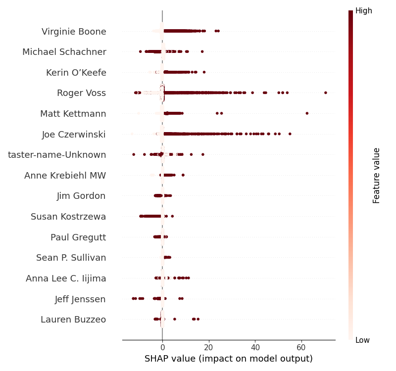

SHAPLEY WATERFALLS PLOTS

Another useful function in the shap library is the waterfall plots. It can used to visualize the influences the predicted prices of an individual wines are.

Below is a Bordeaux Supérieur from Château Meillier. The vertical line, shown as E\[f(X)\] on the x-axis at $35.532, is the mean price for all the wines. The bottom arrow shows the 3,107 least important features together pull the price down -$3.67. Then the impact of the top 20 features is shown. One can see the most serious problem with this wine is the points received, _norm-points =_ -0.529, pulled the price down -$9.06. The best thing about the wine is it is a _Bordeaux_, which lifted its price by +$1.08. The predicted price ended up to $15.88, which is with 22% of the actual price of $13.

Below is an expensive port by _Kopke_ which is a very high-end Port wine. The winery name lifted the price by a whooping +$141.53. It received a very high score (1.758 norm-points) which increased the price by +$134.06. [_Coheite_](<https://www.wine-searcher.com/regions-colheita+port>) is a very high-end _designation_, and [Coheite _White_]([<https://www.portugalvineyards.com/en/blog/colheita-white-port-a-very-special-port-n1426\>) is even more premium. Thus even the word _White_ had a lift of +$54.82; note this word it does not have such positive price impact in other white wines. This lift only happens at a sub-branch of decision trees specific for _Coheite Port_. The bigram of Coheite_white is probably too rare on the corpus to show up as a feature. The predicted price ended up to be $699.07, which is about 29% below the actual price of $980
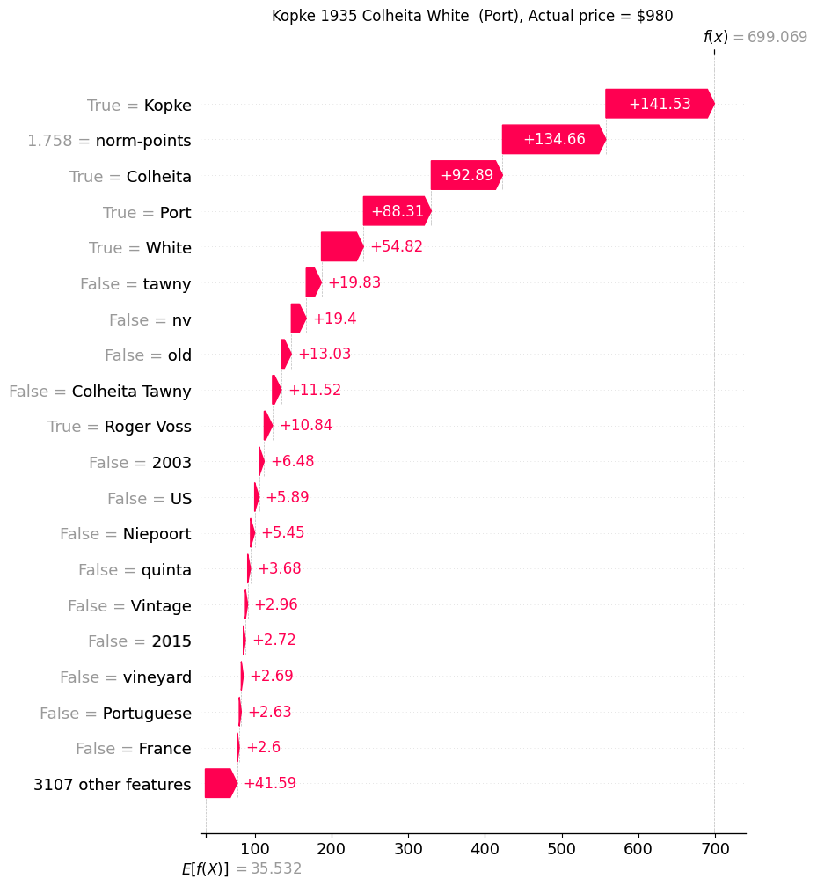

Below is a _Barolo_, known as the “King of Wines, the wine of kings” (“_il re dei vini, il vino dei re_”) from Italy. Made by _Vietti_ from _Nebbiolo_ grapes from _Rocche di Castiglione, Piedmont_. These are the key drivers to boost the prediction to $128.04, which is only 14% below the actual price of $150.
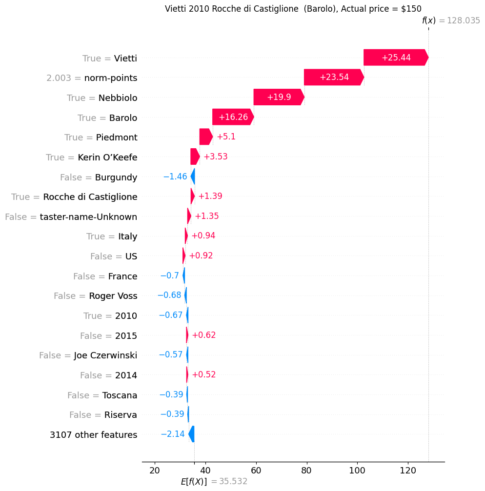

**SUMMARY**

1. I built a GBM, an RFM, and a deep neural network model. The RFM had the best performance, with a holdout MdAPE of 20.7% and R2 of 43.7%
2. I used the GBM model to calculate the _Shapley values_ of the features (Using the RFM took too long, probably because of both the large size and large number of trees.). This can be used in wine marketing.
    1. The Shapley values not only tell us which features are important, but also how they impact predictions.
    2. The waterfall plots tell us in dollar terms how each term impacts the price of a wine.

