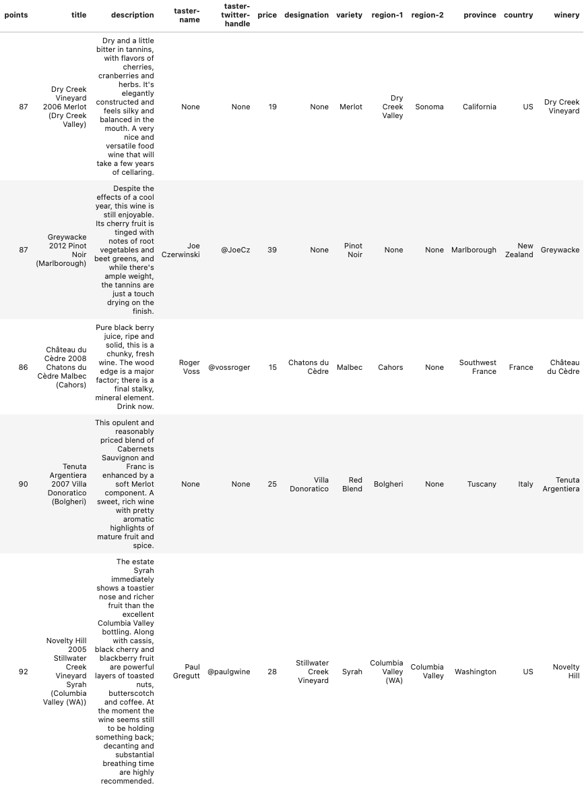

<h1>Wines of the world</h1>

<figure>
    
    <figcaption>Source: https://vacationmavens.com/184-wine-tasting-tips-and-wine-travel/</figcaption>
</figure>  

This work is based on the [“Wine Reviews”](<https://www.kaggle.com/datasets/zynicide/wine-reviews>) data set published on Kaggle, where it can be downloaded. The details of the data are discussed there also. This work has two main threads:

1.  A wine price predictor model.

2.  A wine recommender, based on a user's instantaneous text input.

<h3>Topline summary:</h3>

1.  The best <i>price predictor</i> model was the Random Forest Model, which yielded an MdAPE of 20.6% and R2 of 0.435. To  skip head and read details about the <i>price predictor</i> model, [click here.](./wine_libraries/price_model/README.md)

2.  A <i>wine recommender model</i> that uses a sentence input of the user to recommend wines was successfully trained.  To skip ahead to the results of the <i>wine recommender </i>model, [click here](./wine_libraries/wine_recommender/README.md)

<h3>This README page goes into the details on data.  To skip to results, please click on one of the two links above.</h3>

<h3>INTRODUCTION TO THE DATA SET</h3>

Briefly, it contains about information for about 110,000 unique wines (after deduplication). The following is a random sample of the data set, shown in a pandas dataframe format. Below are 5 randomly sampled wines of the data set.

<figure>
    
    <figcaption>Figure: Data sample</figcaption>
</figure>
 
 

| Column name | Explanation | Notes/Examples |
| --- | --- | --- |
| Points | Number of points given by the taster (see Taster-name) | Integer from 80 to 97. |
| Title | This is the text that appears on the label. It almost always contains the vintage (year of production). | Gloria Ferrer NV Sonoma Brut Sparkling (Sonoma County) |
| Description | The review by the taster. This typically is a text of about a few hundred words. |_"This dry Vinho Verde shows great crisp, green apple and grapefruit flavors, a deliciously fresh wine, with green edges and lively flavors. Great summer drink."_ |
| Taster-name | Name of the reviewer (if available) | Virginie Boone |
| Taster-twitter-handle | Taster twitter handle. |  (Redundant for our purpose, not used) |
| Price | Price of wine | _Range_: $4 to 3,330,  _Mean_: $35.62,   _Median_: $25 |
| Designation | Addition description found on the label of the wine, in addition to the title. Not entirely consistent. |Top 5: _1.'Grande Reserva', 2.'Klipsun Vineyard', 3.'Montée de Tonnerre Premier Cru', 4.'San Lorenzo', 5.'Lawrence Vineyard'_|
| Variety | This typically contains the variety of the grape, or if it is a blend or unknown it is the type of the wine. | Pinot Noir, Gewürztraminer. |
| Region-1,  Region-2, Province, Country| These four columns tell the location the wine came from. The info is sometimes redundant, and the categorization is not always consistent. |'Napa Valley', 'Napa', 'California', 'US'|
| Winery | The name of the winery |'Kendall-Jackson'|
  

<h3>POINTS</h3>: This is the points given by the reviewer to the wine. The range is 80-100 points, with a mean of 88.4 ± 3.1 1&#963; .
<figure>
    
<figcaption>Figure: Distribution of reviewers' raw points</figcaption>
</figure>
 
 

However, each taster has bias and variance (or grades by a different curve, in layman parlance), so the points are normalized by the subtracting it from the mean and dividing it by the standard deviation for the taster. The normalized points (called norm-points) are used instead of points in the model.

| **taster-name** | **count** | **mean points** | **min** | **max** | **std** |
| --- | --- | --- | --- | --- | --- |
| Alexander Peartree | 381 | 85.78 | 80  | 91  | 1.9 |
| Anna Lee C. Iijima | 3974 | 88.41 | 80  | 98  | 2.6 |
| Anne Krebiehl MW | 3036 | 90.68 | 80  | 97  | 2.4 |
| Carrie Dykes | 128 | 86.34 | 81  | 92  | 2.0 |
| Christina Pickard | 6   | 87.83 | 82  | 93  | 3.6 |
| Fiona Adams | 24  | 86.75 | 82  | 91  | 1.8 |
| Jeff Jenssen | 436 | 88.33 | 82  | 97  | 2.1 |
| Jim Gordon | 3761 | 88.60 | 80  | 97  | 2.7 |
| Joe Czerwinski | 4644 | 88.52 | 80  | 100 | 2.9 |
| Kerin O'Keefe | 8885 | 88.94 | 80  | 100 | 2.5 |
| Lauren Buzzeo | 1582 | 87.50 | 81  | 95  | 2.5 |
| Matt Kettmann | 5643 | 90.09 | 81  | 97  | 2.6 |
| Michael Schachner | 13871 | 86.86 | 80  | 98  | 3.1 |
| Mike DeSimone | 452 | 89.12 | 82  | 94  | 2.0 |
| Paul Gregutt | 8838 | 89.10 | 80  | 100 | 2.9 |
| Roger Voss | 18543 | 88.62 | 80  | 100 | 3.1 |
| Sean P. Sullivan | 4423 | 88.76 | 80  | 97  | 2.5 |
| Susan Kostrzewa | 1011 | 86.59 | 80  | 94  | 2.4 |
| Unknown | 23273 | 87.78 | 80  | 100 | 3.3 |
| Virginie Boone | 8682 | 89.22 | 80  | 99  | 3.1 |
  

<h3>PRICE</h3>

Most of the wines are priced below $36. However, the highest priced wines are $3,300. Because of the sparsity of data at higher prices, the error of the ML model’s predictions increase as the price increases.

| &nbsp; | Minimum | Maximum | Mean | Median |
| --- | --- | --- | --- | --- |
| Price | $4  | $3,300 | $35.62 | $25 |

<h4>price distribution</h4>

<figure>
    

<figcaption>Figure: price histogram on linear (l) and logarithmic (r) scales</figcaption>
</figure>
 
 

<h3>LOCATION INFORMATION</h3>
<figure>
    
<figcaption>Figure: Top 40 designations. This field typically contains extra information probably found on the label of the wine, in addition to that already covered in the <i>title</i>. It is not entirely consistent. 
</figcaption>
</figure>
 
 

<figure>
    
<figcaption>Figure: Top 40 wine varieties.  Often this is the name of the grape. This is usually the feature most recognized by the wine consumer, so it is a very important category.
</figcaption>
</figure>
 
 

| **country** | count |
| --- | --- |
| **US** | 50238 |
| **France** | 16286 |
| **Italy** | 15506 |
| **Spain** | 6049 |
| **Portugal** | 4502 |
| **Chile** | 4130 |
| **Argentina** | 3501 |
| **Austria** | 2536 |
| **Australia** | 2169 |
| **Germany** | 1951 |
| **New Zealand** | 1240 |
| **South Africa** | 1195 |
| **Israel** | 453 |
| **Greece** | 427 |
| **Canada** | 224 |
| **Bulgaria** | 132 |
| **Hungary** | 128 |
| **Romania** | 102 |
| **Uruguay** | 98  |
| **Turkey** | 81  |
| **Georgia** | 74  |
| **Slovenia** | 70  |
| **Croatia** | 68  |
| **Mexico** | 68  |
| **England** | 59  |
| **Moldova** | 56  |
| **Unspecified** | 55  |
| **Brazil** | 44  |
| **Lebanon** | 32  |
| **Morocco** | 24  |
| **Peru** | 16  |
| **Ukraine** | 14  |
| **Czech Republic** | 11  |
| **Macedonia** | 11  |
| **Cyprus** | 10  |
| **Serbia** | 8   |
| **India** | 8   |
| **Switzerland** | 6   |
| **Luxembourg** | 5   |
| **Bosnia and Herzegovina** | 2   |
| **Armenia** | 2   |
| **Slovakia** | 1   |
| **China** | 1   |

Table: Above is the comprehensive list of countries of the wines in the data set. Notice most wines in the data set are from the US. This is not surprising, as the reviewers are all Americans.
 
 

Here are the 40 most popular _geographic locations_ from which the wine came.  

<figure>
    
<figcaption>Figure: Top 40 most popular wine locations</figcaption>
</figure>
 
 

<h3>Models were trained for two separate use cases:</h3>
1.  Price model:  Employs the text, winery, and geographic origin of the wine, and the score (points) given by its review to predict its price.  [click for <i>wine price predictor</i> summary here](./wine_libraries/price_model/README.md)
2.  Wine Recommender:  Based on the taster review text, it allows the user to describe the wine she/he wants and the price she/he wants to pay, and the model will recommend the best wines. [click for <i>wine recommender</i> summary here](./wine_libraries/wine_recommender//README.md)