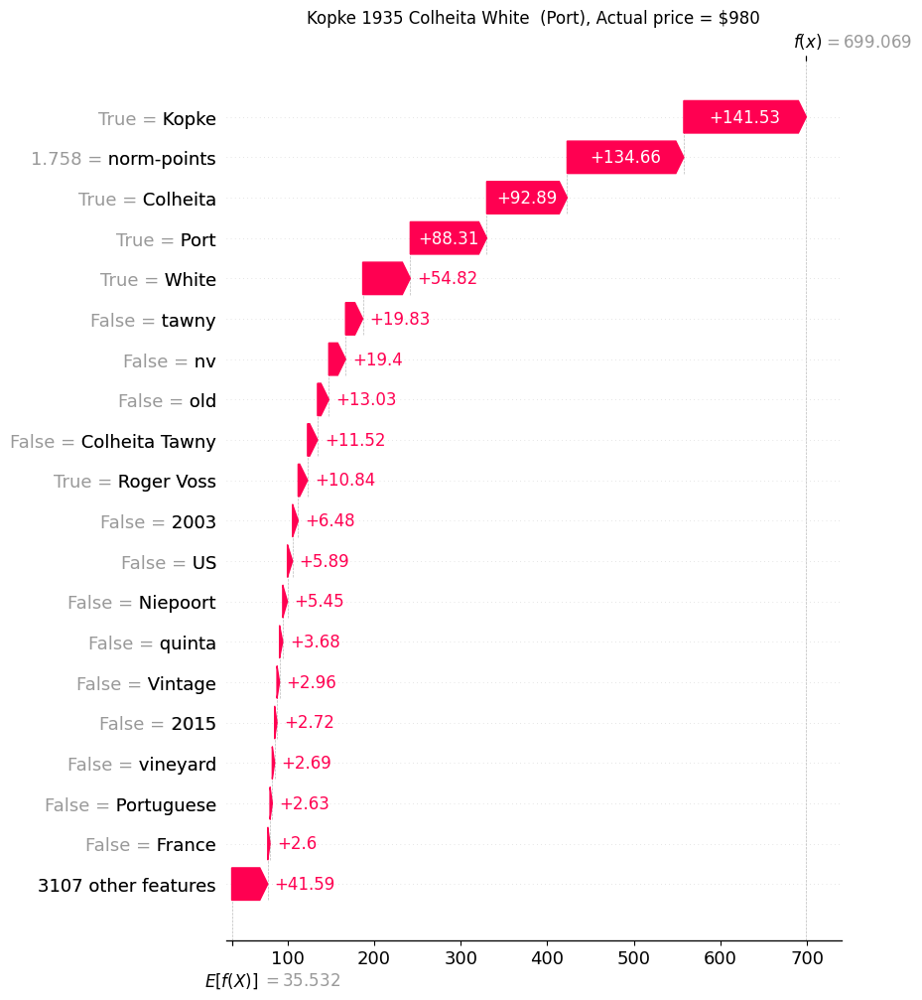
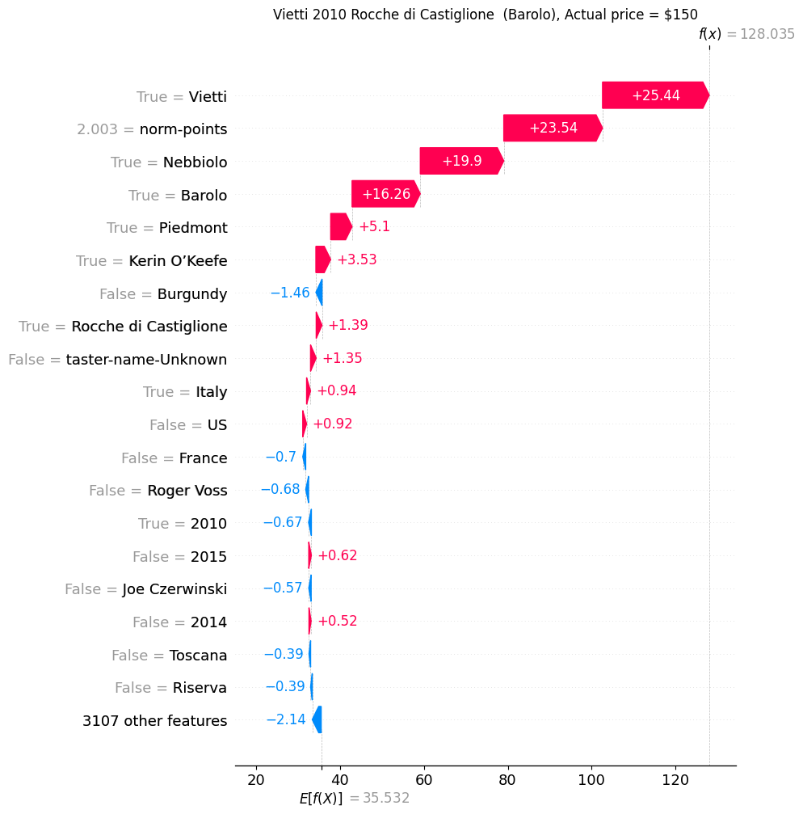

<h1>Price model</h1>

<h3>Topline summary:</h3>

1.  The best model was the Random Forest Model (RFM), which yielded an MdAPE of 20.6% and R2 of 0.435.

2.  Next best is the Gradient Boosting Model (GBM), which yielded an MdAPE of 21.9% and R2 of 0.445.  The 6-layer DNN model surprisingly performed the worst, with an MdAPE of 26.6% and R2 of 0.466.

<h3>Business use case:</h3>

1. Price determination: How much should a vendor price a wine?
2. Marketing:
    a. What are the terms to put on or leave off a label?
    b. What are the desirable intrinsic aspects of a wine (variety, location, etc.)?

<h2>FEATURIZATION</h2>

- The main data were divided into three sets (train, val, holdout) in the proportions of 8: 1: 1.
- Pipeline (sklearn) was used to featurized to avoid data leak. As a consequence, all the substeps were enclosed in a python wrapper object with <i>.fit</i> and <i>.transform</i> methods.

1. Points: See section on points above.

2. Text (title)
    a. The general scheme is to tokenize the title and variety into words and convert them into one-hot columns of monograms and bigrams. Bigrams are important in general. In the present use case, many of the grapes which were derivatives of the same variety but have very different flavor profiles. For example, <i>Pinot+Noir</i> and <i>Pinot+Gris,</i> and <i>Cabernet+Sauvignon</i> and <i>Sauvignon+Blanc</i>. It is better to link them beforehand rather than relying on the model to discover them.

    b. Stop words. Custom stop words. Remove foreign articles. No need for entire stop words our corpus is proper nouns, and not made of complete sentences.

    c. “<i>Saint words</i>”: The proper names of many labels and locations are meaningless on their own. They are linked up to the words ahead of them. Example: <i>St. Emilion</i> becomes <i>StEmilion</i>.
    

3. Designation and Location: 
**Winery** **name**, **designation**, and location (**region, province, country, and taster-name**) were <i>not</i> one-hotted as the complete expression represents unique information. For example, “<i>New York”</i> means one thing, but <i>New</i> and <i>York</i> separately can mean two separate things.

<h2>MODELS</h2>

<h3>GBM:</h3> 

1. Employs weak learners (short trees) in series to fit the residues.  

2. Typically the highest performing decision tree based model. 

3. Regularization: Number of features per tree.

4. The drawback is its speed, since it builds decision trees in series so it is difficult to parallelize.
    

<h3>RFM: </h3>

1. Uses strong learners (deep trees). 

2. Avoids overfitting by fitting multiple trees in parallel.  

3. Trees are <i>decorrelated</i> by changing the features each has access to (max_features parameter)

4. Usually performs slightly less well the GBM.  Good for Proof of Concept experiments.

<h3>Neural Network: </h3>
1. State of the art.
2. However, requires a lot of data takes a long time to train.
3. Often does not performs as well as <i>decision tree</i> models on tabulated data.

<h3>RESULTS:</h3>

|     | |  |     |     |     |
| --- | --- | --- | --- | --- | --- |
| Model | **Holdout MdAPE (%)** | **Holdout R^2** | **model library** | **Parameters** | **Notes** |
| GBM | 21.9 | 0.445 | xgboost.XGBRegressor | lr = 1e-4, autostop = 20, num trees = 91596, max tree depth = 6 | It takes about six hours to run this, which is longer than the Random Forest model, because the trees have to built in series. Typically, this model performs better than random forest, but not in this case. |
| RFM | 20.6 | 0.438 | scikit learn RandomForestRegressor | max_depth= 250,  num of trees = 2000,  max number of features per tree = "sqrt" or sqrt(3000) = 55. | The is surprisingly fast, taking slightly less than one hour on my Mac M2 laptop (10 GPU), because the trees can be trained in parallel. However, what is even more surprising is it achieved a slightly lower error than GBM. |
| Neural Network | 26.6 | 0.466 | Keras | Layers = (128, 64, 32, 16, 8, 4, 2), dropouts = 0.2 | I rejected this model early because it took too long to train neural network for this task. To speed things up, I selected the top 128 most popular features among the 3000 to put in the model. I have the tried using PCA to select the best results, but that would lose the useful information on feature importance. It is well known that <i>decision tree</i> models tend to perform better the neural network models.  It is especially not worthwhile unless you have a very large data set.  (110k data points is small)

Both the <i>decision tree</i> models perform well with MdAPE ~ 20-22%.  For pure price prediction purpose, we should employ the RFM model because it yielded marginally better results.  However, for the next section involving Shapley value analysis, we shall employ the GBM model because it takes much longer to calculate the Shapley values of an RFM than for a GBM model.  

<h2>IMPORTANT FACTORS THAT AFFECT PRICES</h2>

Often it is useful to find which features have the biggest impact on the results of the model. The simplest is to use the “feature_importance” output of the decision tree model. There are many ways to calculate it, but mostly often, it is the sum of the losses caused by the feature. Below is the top 40 features for the Random Forest Model. One can see that the importance is dominated by the norm-point (normalized points given by the taster), then followed by the vintage (i.e. year) of the wine. <b><i>This is likely to be too simplistic.</i></b>

<figure>
    
    <figcaption>Table: Feature Importances</figcaption>
</figure>

<h2>SHAPLEY VALUES</h2>

A better approach is find the [<i>Shapley Values</i> ](<https://www.investopedia.com/terms/s/shapley-value.asp#:~:text=Essentially%2C%20the%20Shapley%20value%20is,or%20less%20than%20the%20others.>)for the features. It derives from the <i>marginal contribution</i> of each feature to a prediction, after applying all other features. In game theory, Shapley values help determine how much each player in a collaborative game has contributed to the total payout. For a machine learning model, each feature is considered a "player". The Shapley value for a feature represents the average magnitude of that feature's contribution across all possible combinations of features. Specifically, Shapley values are calculated by comparing a model's predictions with and without a particular feature present. This is done iteratively for each feature and each sample in the dataset. By assigning each feature an importance value for every prediction, SHAP values provide a local, consistent explanation of how the model behaves. They reveal which features have the most impact on a specific prediction, whether positively or negatively. This is valuable for understanding the reasoning behind complex machine learning models such as [<i>deep neural networks</i>](<https://www.kdnuggets.com/2023/08/shap-values-model-interpretability-machine-learning.html>)

We employ the [python SHAP models](<https://shap.readthedocs.io/en/latest>) to carry out the calculations and the plotting. Another important advantage of shap values it allows us to see not just the degree, but also the sign of a feature’s impact (positive or negative) on the prediction. It takes much longer to run shap on the RFM model (more than 2 weeks so I had to stop) than on the GBM (2 days) because the large number and large sizes of the decision trees in the former, whereas in the latter model, even though the trees are more numerous, they are much smaller.

1. It is unclear why <i>norm-points</i> is ranked very low by the GBM model’s native <i>Feature_importances</i>. In fact, at rank 44 it is outside of the table. However, <i>norm-points</i> is ranked first by shap.   This makes more sense, as this this the feature that many pay attention when buying or pricing a wine.  <i>Feature_importances</i> is determined by the loss during modeling, whereas the shap values are determined by the incremental change in prediction when the feature value is changed. It is possible that at a fundamental level, there is a difference between the two.  Some wines or regions drive the prices up, such as <i>Napa, Burgundy, Champagne.</i>

<figure>
    
    <figcaption>Figure: Top ranked shap values (overall)</figcaption>
</figure>

2. <i>Champagne</i> was the most expensive grape type. Surprising, <i>merlot</i> was having a resurgent. <i>Sauvignon Blanc</i> was the lowest cost wine type.
<figure>
    
    <figcaption>Figure: Top ranked shap values for <i>Grape</i> type<</figcaption>
</figure>
 
 

3. The best wines are French.
<figure>
    
    <figcaption>Figure: Top ranked shap values for <i>Countries</i> type<</figcaption>
</figure>
 
 

4. Shapley values can also shed light on the impact of vintage on the price of the wine. Below we can see Year 2009 is the best year, whereas 2014 is probably the worst.

<figure>
    
    <figcaption>Figure: Top ranked shap values for <i>Vintages</i> type</figcaption>
</figure>
 
 

5. For the US, Napa Valley on average drives the price highest, although there are more good wines from Sonoma which as a group has the most positive impact.
<figure>
    
    <figcaption>Figure: Top ranked shap values for Selected <i>US Regions</i> </figcaption>
</figure>
 
 

6. Most tasters choose expensive wines to taste, or their ratings would drive the prices up, such as <i>Virginia Boone</i> and <i>Joe Czerwinski</i>. However, some of the tasters, such as <i>Susan Kostrzewa</i> and <i>Jeff Jenssen</i> do prefer to sample wines that are “for the masses.”
<figure>
    
    <figcaption>Figure: Top ranked shap values among <i>Tasters</i> </figcaption>
</figure>
 
 

Note: More shap value examples can be found in the [images/shap_figs](./images/shap_figs) folder.

<h2>SHAPLEY WATERFALLS PLOTS</h2>

Another useful function in the shap library is the waterfall plots. It can used to visualize the influences the predicted prices of an individual wines are.

Below is a Bordeaux Supérieur from Château Meillier. The vertical line, shown as <i>E\[f(X)\]</i> on the x-axis at $35.532, is the mean price for all the wines. The bottom arrow shows the 3,107 least important features together pull the price down -$3.67. Then the impact of the top 20 features is shown. One can see the most serious problem with this wine is the points received, <i>norm-points =</i> -0.529, pulled the price down -$9.06. The best thing about the wine is it is a <i>Bordeaux</i>, which lifted its price by +$1.08. The predicted price ended up to $15.88, which is with 22% of the actual price of $13.
<figure>
    
    <figcaption>Figure: Waterfall plot for <i>Château Meillier </i> </figcaption>
</figure>
 
 

Here is an expensive port by <i>Kopke</i> which is a very high-end Port wine. The winery name <i>Kopke</i> lifted the price by a whooping +$141.53. It received a very high score (1.758 norm-points) which increased the price by +$134.06. [<i>Coheite</i>](<https://www.wine-searcher.com/regions-colheita+port>) is a very high-end <i>designation</i>, and [Coheite <i>White</i>]([<https://www.portugalvineyards.com/en/blog/colheita-white-port-a-very-special-port-n1426\>) is even more premium. Thus even the word <i>White</i> had a lift of +$54.82; note this word it does not have such positive price impact in other white wines. This lift only happens at a sub-branch of decision trees specific for <i>Coheite Port</i>. The bigram of Coheite_white is probably too rare on the corpus to show up as a feature. The predicted price ended up to be $699.07, which is about 29% below the actual price of $980
<figure>
    
    <figcaption>Figure: Waterfall plot for <i>Kopke 1935 </i> </figcaption>
</figure>
 
 

Below is a <i>Barolo</i>, known as the “King of Wines, the wine of kings” (“<i>il re dei vini, il vino dei re</i>”) from Italy. Made by <i>Vietti</i> from <i>Nebbiolo</i> grapes from <i>Rocche di Castiglione, Piedmont</i>. These are the key drivers to boost the prediction to $128.04, which is only 14% below the actual price of $150.

<figure>
    
    <figcaption>Figure: Waterfall plot for <i>Vietti Barolo</i> </figcaption>
</figure>
 
 

Note: More waterfall plot examples can be found in the folder [here](./images/shap_figs/) .

<h2>PRICE MODEL SUMMARY
</h2>

1. I built a GBM, an RFM, and a deep neural network model. The RFM had the best performance, with a holdout MdAPE of 20.7% and R2 of 43.7%

2. I used the GBM model to calculate the <i>Shapley values</i> of the features (Using the RFM took too long, probably because of both the large size and large number of trees.). This can be used in wine marketing.
    1. The Shapley values not only tell us which features are important, but also how they impact predictions.
    2. The waterfall plots tell us in dollar terms how each term impacts the price of a wine.
