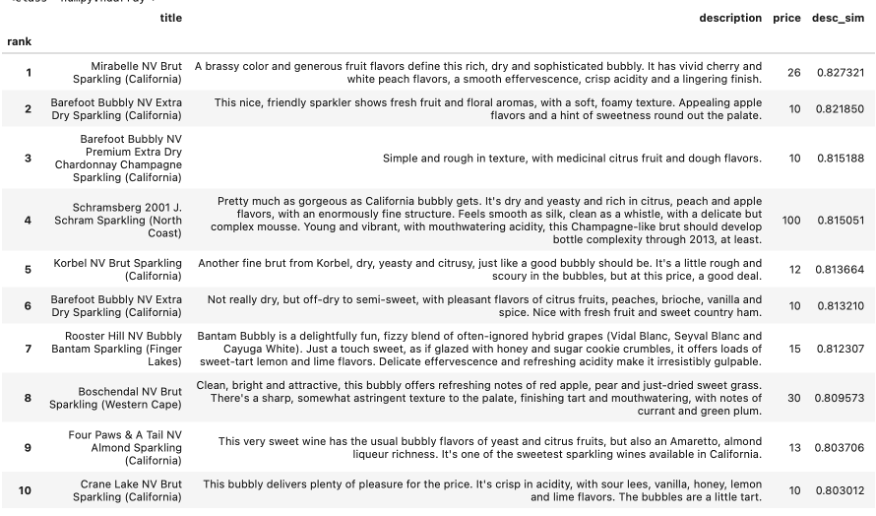
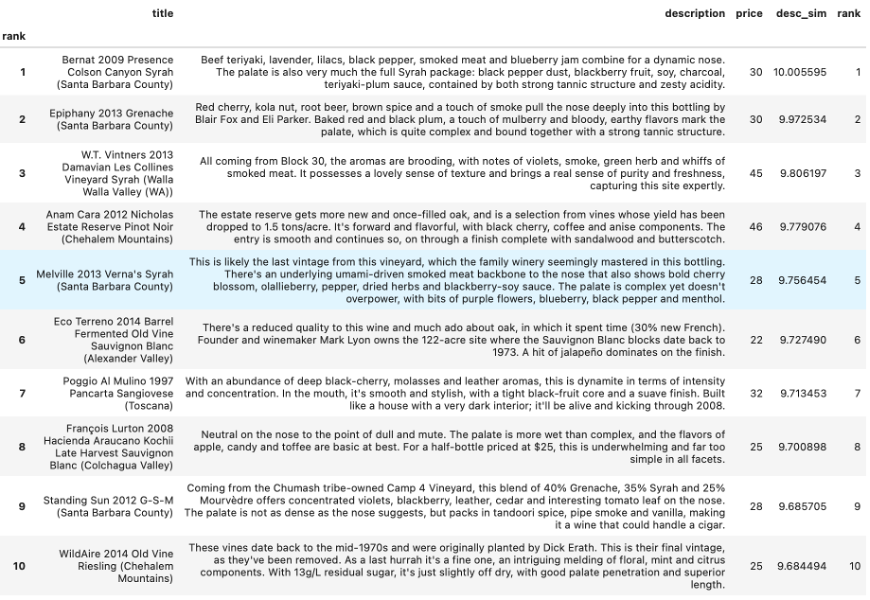
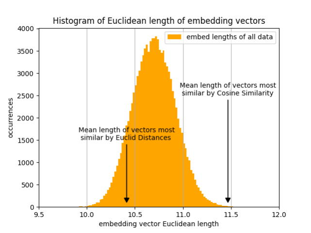
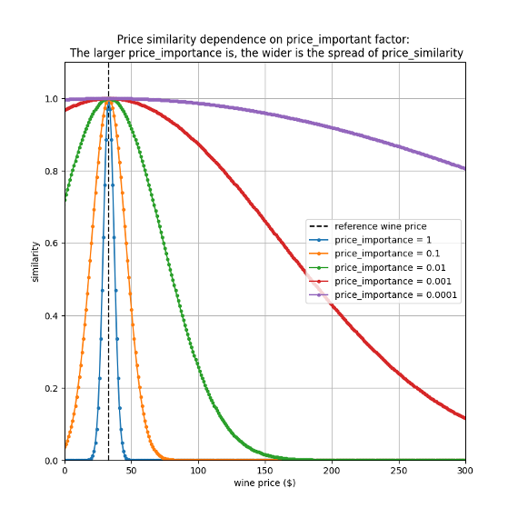
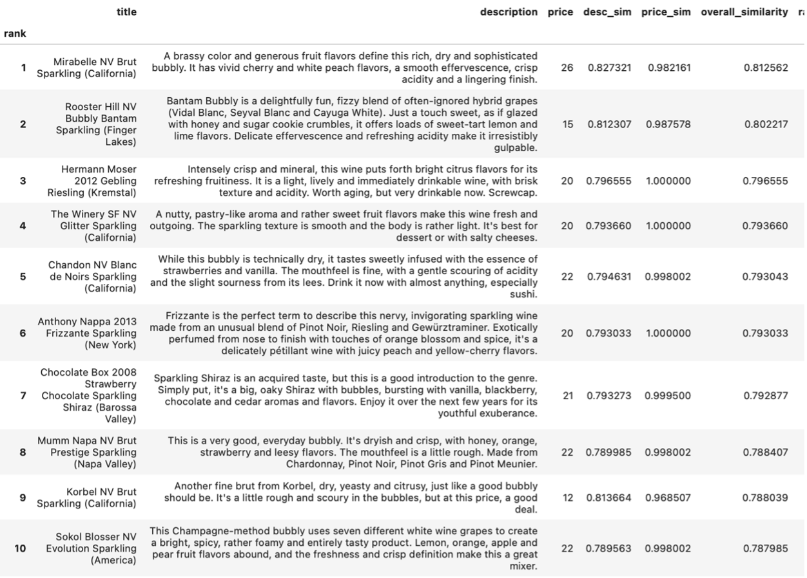
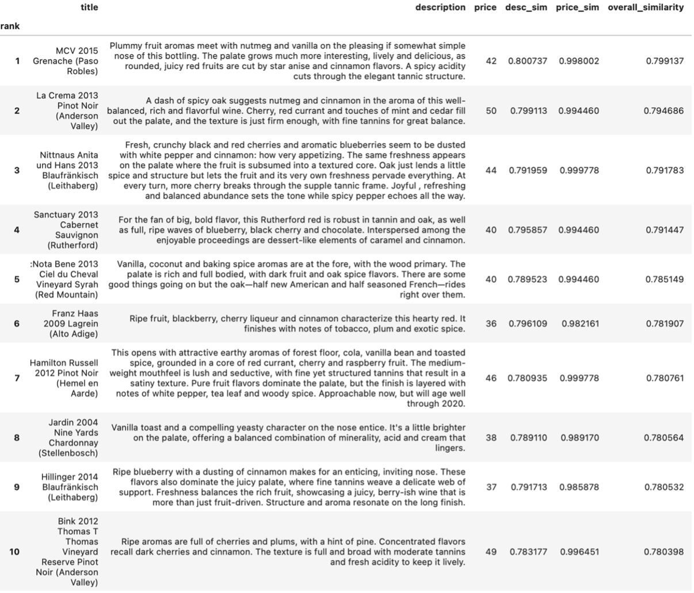
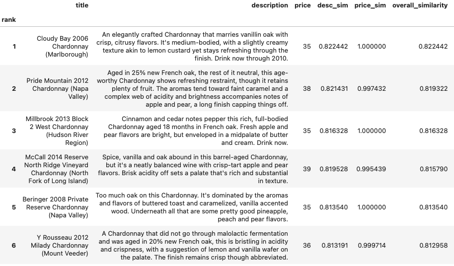

**Wine recommender**

Goal: Build a model that help a wine lover find a wine similar to what she/he likes, and at a price point she/he desires.

BUSINESS MOTIVATION

A wine lover often wants to find a wine…

1. with a certain set of characteristics. For example, “_A refreshing sparkling rose with orange and peach” or “A robust red with cinnamon, coconut, and netmeg.”_
2. that has been positively reviewed, but perhaps it was not available at a nearby store or even on-line, so an alternative is desired, or the reviewed wine was too expensive, so a lower-priced one is sought.

A different approach is needed to satisfy these two business needs. Whereas in building the price model, we ignore the text by the wine reviewers, here will be completely lean into them. Here the model not only needs to know the words such as _orange/citrus_ and _strong/robust_ are similar in meaning, but also the overall “sentiment” of the text.

HOW WE DETERMINE _WINE SIMILARITY_

We want to determine similarity by the actual intrinsic characteristics of the wine, such as the aroma and the taste, not the words used by some marketing person in the marketing department or the name given to the region from which the wine comes. Thus forgo any extrinsic quality of the wine, such as the title and the location information. Instead we will fully leverage the taster’s review (“description”). Ideally we will have to compress the info with an unsupervised learning model. Training this kind of models requires a very large data set, much larger than the relatively measly 110k in this data set. In the past, we would have to train the model ourselves, and fine-tune them to our specific needs. Luckily today there are publicly available models that can accomplish our task. The approach to training this kind of “sentence transformers” involves creating a vector space (embeddings) that map query-response pairs as close to each other into multi-dimensional vector space. [See semantic search.](<https://www.sbert.net/examples/applications/semantic-search/README.html>) A large number of these public sentence transforms can be found in at [hugging face](<https://huggingface.co/sentence-transformers>).

Each of these transformers converts a text to an embedding of 768 dimensional vector. There are many to choose from. We picked the [msmarco-distilbert-dot-v5 transformer](<https://github.com/microsoft/msmarco/blob/095515e8e28b756a62fcca7fcf1d8b3d9fbb96a9/Datasets.md>) (from Microsoft), which is based on the ranked results of the corpus is 3.2 million documents and our training set has 367,013 queries, with the assumption that a document that produced a relevant passage is usually a relevant document . An important reason we selected this transformer is it can accommodate the longest text (512 words). While the longest review text in the present corpus is only 135 words long (after removing stop words), it is possible in the future a review can have an outlying length of > 256 words, which is the transformer with the next longest word limit.

COSINE SIMILARITY vs. EUCLIDEAN DISTANCE

Once the review texts have been transformed to embeddings, the similarity between any two wines can be estimated by calculating the Cosine Similarity (CS) or the Euclidean Distance (ED) between the two embeddings. While it is difficult to quantify the relative effectiveness of two approaches, it is possible to see cosine similarity leads to better results.

For example, for the input description “**_I want a bubbly fruity refreshing sparkling wine_**_.”_

Here are the top 10 results produced by **cosine-similarity (Excellent)**.

As one can see, they are excellent responses to the input text.

Here are the top 10 results from **Euclidean distance (bad)**.

These results are simply bad. None of the wines are even sparkling wines.

Why did CS produce so much better results? One likely explanation is the notorious [“curse of dimensionality”](<https://datascience.stackexchange.com/questions/27726/when-to-use-cosine-simlarity-over-euclidean-similarity>). The embeddings have a dimension of 768. At such large dimensions, points in general are very far away from each other. It is thus very sensitive to noise in the system. CS on the other,

Further investigation revealed another explanation: The most similar wines by ED tend to have the shorter Euclidean vector length. The same wine for Euclidean Distance keep appearing regardless of our input. The likely explanation is these are wines that exist nearer to the center of the vector space, so their descriptions tend to be more generic, and there are _closest_ most other wines. In our examples, these recommended wines generated by ED are so generic that they don’t even resemble the specific wine they are supposed to be similar too. On the other hand, the similar wines generated by CS are on the edges of the vector spaces, so farther from the center, meaning they are more specific. This is probably why they better tailored to the text input.

PRICE SIMILARITY

No wine consumer will ignore the price of a wine in the selection process. Thus any good wine recommender must account for it.

One possible use case is if a consumer likes a certain wine but it is out of the affordability range, the model should account for it price. Any successful wine recommender needs to account for this in its modeling. We employ the following function, which is the normalized variance of the prices, multiplied by a _price importance_ (0 ≤ price_imp ≤ 1) factor.

### _Similarityprice = exp -(priceinterest - price another wine) 2 price_importance 2 /priceinterest2_ ###

Note the impact of the price_imp scales exponentially. The figure below shows its impact. A factor of 1 would be too powerful and it would narrow the choices too much. We choose a factor 0.01 (green). However, this can be tailored by the user as she/he sees fit.

OVERALL SIMILARITY

The overall similarity is product of the description and price similarities.

Here are some examples:

Below show the response to the input of text of the wine and the price desired, and a price importance of 0.01.

Your wine = “**I want a bubbly fruity refreshing sparkling wine**. "Your price = $20

Your wine = "**robust red wine with hints of vanilla cinnamon coconut nutmeg**”.
Your price = $45

Your wine = "**a mature creamy chardonnay aged with oak**"
Your_price = 35

Note: More wine recommender examples can be found in the [images/wine_recommender](./wine_libraries/images/wine_recommender) folder.

As one can see, the model works very well. It can be used to help wine lovers look for the wine at they want at a price point they can afford.